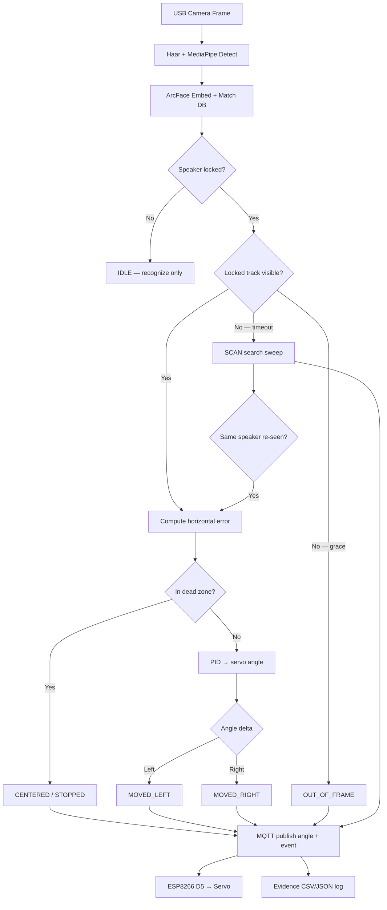

# BENAX SRS — Software Alignment Status

Single-speaker face recognition + MQTT camera tracking (FaceLocking).

**Last updated:** software-ready for hardware integration; ~**85–90%** of SRS software scope complete.

---

## Completion summary

| SRS activity | Status | Project implementation |
|--------------|--------|------------------------|
| Speaker face enrollment (10–30 samples) | **Done** | `python -m src.enroll` — min 10, max 30 samples, ArcFace template in `data/db/` |
| Single-identity recognition (speaker lock) | **Done** | `track.py` / `recognize_with_tracking.py` — locks one enrolled identity, ignores others |
| Face tracking + command generation | **Done** | PID pan tracker + SRS commands: `MOVED_LEFT`, `MOVED_RIGHT`, `CENTERED`, `STOPPED`, `OUT_OF_FRAME`, `SCAN` |
| MQTT embedded motor control | **Done** | `mqtt_camera_controller.py` + `arduino/esp8266_camera_tracker/` |
| Evidence logging | **Done** | `evidence_logger.py` → `data/history/*_evidence.csv` + `*_evidence_summary.json` |
| Re-acquisition / search | **Done** | Lost-target timeout → sweep → re-lock (`SEARCH_REACQUIRE_FRAMES`) |
| Flowchart / pipeline diagram | **Done** | See below |
| Hardware integration demo | **Pending** | Waiting for FalconEye camera, 2-DOF mount, CP2102 driver, MQTT on LAN |

---

## Recognize → Track → Command pipeline



---

## MQTT topics

| Topic | Direction | Payload |
|-------|-----------|---------|
| `camera/track/horizontal` | PC → ESP8266 | Servo angle `0–180` (e.g. `95`) |
| `camera/track/command` | PC → ESP8266 | `left`, `right`, `center` |
| `camera/track/events` | PC → broker | SRS JSON: `event`, `speaker`, `confidence`, `motor_command` |
| `camera/status` | ESP8266 → broker | `{"angle":90,"target":90,"moving":false}` |

---

## Hardware wiring (SRS materials)

| Component | Connection |
|-----------|------------|
| Servo signal | **D5 (GPIO14)** on ESP8266 |
| Servo VCC | **VIN** (5V) |
| Servo GND | **GND** |
| ESP8266 | USB power + Wi-Fi to MQTT broker |
| Camera | USB to PC (AI runs on desktop) |

> If you already wired the servo to **D4**, change `SERVO_PIN` in the `.ino` file back to `D4`.

---

## Demo commands (assessment)

```powershell
.\.venv\Scripts\activate

# 1. Enroll speaker (10–30 face samples)
python -m src.enroll

# 2. Test MQTT + servo (no camera)
python test_mqtt_system.py

# 3. Full SRS demo: lock speaker + track + log evidence
python track.py --speaker loic

# 4. Review evidence logs
dir data\history\*_evidence.csv
```

---

## Evidence log fields (assessor)

`data/history/<speaker>_<timestamp>_evidence.csv`:

- `timestamp`, `speaker_id`, `confidence`, `distance`
- `tracking_command` — MOVED_LEFT / MOVED_RIGHT / CENTERED / STOPPED / OUT_OF_FRAME / SCAN
- `motor_command` — LEFT / RIGHT / STOP / SCAN
- `servo_angle`, `servo_target`, `face_center_x/y`, `mqtt_connected`

---

## Remaining before final demo

1. **Flash ESP8266** — install CP2102 driver, upload firmware, confirm Serial Monitor Wi-Fi + MQTT
2. **Mount camera on servo** — 2-DOF tilt manual; pan via servo
3. **Live validation** — multiple faces in frame, occlusion, speaker walk across frame
4. **Optional** — run local Mosquitto if remote broker unavailable

---

## Software stack (SRS requirements)

| Requirement | Package / module |
|-------------|------------------|
| Python 3.10+ | 3.14 (venv) |
| OpenCV | `opencv-python` |
| Face ML | ArcFace ONNX + MediaPipe |
| MQTT | `paho-mqtt` |
| NumPy | `numpy` |
| Logs | CSV/JSON via `evidence_logger.py`, `activity_logger.py` |
